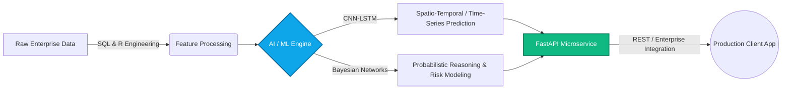

<!--
  GITHUB PROFILE README TEMPLATE FOR: Ahmed Rasheed (ahmedraheed)
  HOW TO USE:
  1. Create a new public repository named exactly matching your username: `ahmedraheed/ahmedraheed`
  2. Copy and paste this content into the `README.md` file of that repository.
  3. Replace placeholder links (like your LinkedIn URL or Email address) with your real details.
-->

# Hi there, I'm Ahmed Rasheed 👋
### Software Engineer & Data Scientist | Enterprise AI & Deep Learning Specialist

---

  <a href="#-about-me">About Me</a> •
  <a href="#-ai--data-science-focus">AI & Deep Learning</a> •
  <a href="#-skills--tech-stack">Tech Stack</a> •
  <a href="#-featured-projects">Projects</a> •
  <a href="#-current-focus--learning-goals">Goals</a> •
  <a href="#-get-in-touch">Contact</a>

---

## 🚀 About Me

I am a **Software Engineer and Data Scientist** with **4 years of professional experience** designing scalable software architecture and transforming complex data into high-performing AI models. My expertise lies at the intersection of robust backend engineering and advanced machine learning, allowing me to build end-to-end intelligent systems that drive real-world enterprise value.

- 🔬 **What I do:** Architect scalable backend services, engineer end-to-end machine learning pipelines, and deploy predictive AI models into enterprise production environments.
- 💡 **Core Engineering Philosophy:** Clean code, reproducible ML experiments, robust systems architecture, and data-driven decision making.
- 🐧 **Environment:** Power user of **Linux (Ubuntu)** for development, model training, and server administration.
- 💬 **Ask me about:** Python/C++ backend optimization, Deep Learning architectures (CNN-LSTM), Probabilistic Modeling, and FastAPI microservices.

---

## 🧠 AI & Data Science Focus

My passion centers on solving complex analytical problems using modern **Deep Learning** and **Probabilistic AI** methodologies. I don't just train models in notebooks—I engineer robust production pipelines.

### ⚡ Specializations:
* **Retrieval-Augmented Generation (RAG) Pipelines:** Designing production-grade LLM applications by integrating semantic vector databases, custom embedding models, and contextual chunking for enterprise knowledge retrieval with zero hallucination.
* **Frappe Framework & ERPNext Enterprise Systems:** Engineering modular, high-performance enterprise resource planning (ERP) architectures using Python and MariaDB within the Frappe ecosystem, automating complex business workflows, accounting, and custom data operations.
* **Convolutional LSTM Networks (CNN-LSTM):** Combining spatial feature extraction (CNNs) with temporal sequential memory (LSTMs) for advanced time-series forecasting, sequential pattern recognition, and predictive analytics.
* **Bayesian Networks & Probabilistic Modeling:** Designing directed acyclic graphs (DAGs) for decision-making under uncertainty, causal inference, and risk assessment in enterprise environments.
* **End-to-End ML Engineering:** Bridging exploratory data analysis (EDA) with production deployment using automated data preprocessing, model evaluation, and high-performance REST APIs.

---

## 🛠️ Skills & Tech Stack

### 💻 Programming Languages

### 🤖 AI, Machine Learning & Data Science

### ⚙️ Frameworks, Backend & Enterprise Systems

### 🖥️ Tools, OS & Environment

---

## 🏆 Featured Projects

| Project | Description | Tech Stack |
| :--- | :--- | :--- |
| **[End-to-End .NET Blog Website](https://github.com/ahmedraheed/Blog-Website)** | Full-stack enterprise web application built with .NET. Features robust backend architecture, database integration, content management, and responsive user experience. | `C#`, `.NET / ASP.NET Core`, `SQL`, `Full-Stack` |
| **[Book Recommender System (End-to-End)](https://github.com/ahmedraheed/Book-recommender-system-End-to-End)** | Full-stack machine learning recommendation pipeline. Integrates collaborative filtering algorithms with automated data cleaning and user-facing delivery. | `Python`, `ML/Collaborative Filtering`, `Jupyter` |
| **[FastAPI CRUD Enterprise Service](https://github.com/ahmedraheed/Fast-API-CRUD)** | High-performance asynchronous REST API backend demonstrating clean architecture, data validation, database integration, and production readiness. | `Python`, `FastAPI`, `SQL/ORM`, `REST` |
| **[Machine Learning Deep-Dive Topics](https://github.com/ahmedraheed/machine-learning-Topics)** | Curated implementations and mathematical explorations of core ML algorithms, neural network architectures, and statistical modeling. | `Python`, `Deep Learning`, `NumPy`, `Scikit-Learn` |

> *💡 Note: Currently organizing and open-sourcing more enterprise AI integrations and deep learning experiments. Stay tuned!*

---

## 🎯 Current Focus & Learning Goals

Continuous evolution is at the core of my engineering career. Right now, I am actively focusing on:

* 🏗️ **Advancing Enterprise System Integrations:** Deepening expertise in deploying scalable ML models into complex legacy and cloud-native enterprise ecosystems using microservices and event-driven architectures.
* ⚡ **Optimizing Deep Learning Inference:** Exploring model quantization, pruning, and C++ acceleration for real-time CNN-LSTM sequential execution.
* 🌍 **Language Acquisition (German A2 ➔ B1):** Currently at an **A2 proficiency level** in German and actively advancing toward **B1 fluency** to broaden international communication skills and collaborate seamlessly with global European tech teams.

---

## 📊 GitHub Analytics

---

## 🤝 Get in Touch & Contribute

I am always open to discussing new opportunities, enterprise consulting, open-source AI collaborations, or interesting software architecture challenges. 

 

  ⭐️ Thank you for visiting my profile! Feel free to reach out or explore my repositories above.

